# Delhi Civic Sense Navigator

A LangGraph-powered agent that routes Delhi citizens to the correct civic authority for
their issue, cites the official source for that routing, fetches live AQI data, provides
a 3D interactive map of civic issues, and drafts submittable complaints — all backed by
Elasticsearch for vector retrieval and query analytics.

**Built for the Elastic + Google Hackathon 2026.**

## Architecture

```mermaid
%%{init: {'theme': 'dark', 'themeVariables': { 'primaryColor': '#6366f1', 'edgeLabelBackground': '#1e1e2e', 'tertiaryColor': '#1e1e2e'}}}%%
flowchart TD
    User(["Citizen"]) --> UI["Vanilla JS Frontend\n(localhost:8000)"]
    UI --> API["FastAPI Backend\n/src/main.py"]
    API --> Agent["LangGraph State Machine\n/src/agent/graph.py"]

    subgraph Agent["Agent Pipeline"]
        direction LR
        C["classify_node\nLLM + keyword fallback"]
        F["fetch_live_data_node\n(only if air_pollution)"]
        R["retrieve_node\nElasticsearch kNN search"]
        G["confidence_gate\nthreshold check"]
        REF["reformulate_query_node\n(retry once)"]
        A["answer_node\nLLM + deterministic fallback"]
        D["complaint_draft_node\n(only if reporting)"]
    end

    Agent --> C --> F --> R --> G
    G -- "low + retry<1" --> REF --> R
    G -- "low + retry>=1" --> A
    G -- "high" --> A
    A --> D

    subgraph Elastic["Elastic Stack (Cloud / GCP us-central1)"]
        ES_VECTOR[("delhi_civic_docs\n119 documents\n dense_vector index")]
        ES_ANALYTICS[("delhi_civic_analytics\nquery logs\nresponse time, type")]
        KIBANA["Kibana Dashboard\nDiscover + Visualizations"]
    end

    subgraph External["External APIs"]
        GROQ["Groq Cloud\nLlama 3.1 8B/70B"]
        WAQI["WAQI API\nlive AQI feed"]
    end

    R -- "vector search" --> ES_VECTOR
    API -- "log analytics" --> ES_ANALYTICS
    ES_ANALYTICS --> KIBANA
    C -- "LLM classify" --> GROQ
    A -- "LLM answer" --> GROQ
    F -- "fetch AQI" --> WAQI

    subgraph Frontend["Frontend Pages"]
        CHAT["Chat\n/"]
        MAP["3D Map\n/map\n(MapLibre GL)"]
        LOGIN["Auth\n/login /register"]
    end

    UI --> CHAT
    UI --> MAP
    UI --> LOGIN
    MAP -- "/api/map/issues" --> API

    style User fill:#f59e0b,color:#000
    style Elastic fill:#1e1e2e,stroke:#6366f1,stroke-width:2
    style External fill:#1e1e2e,stroke:#22c55e,stroke-width:2
    style Frontend fill:#1e1e2e,stroke:#a855f7,stroke-width:2
```



## The Problem

Delhi's civic administration is fragmented across multiple bodies — MCD (12 zones), PWD,
Delhi Jal Board, BSES/BYPL, DPCC, NDMC, DDMA, and more. A citizen with a pothole,
garbage pile-up, or broken streetlight has to figure out *which* agency handles it,
find the right helpline, draft a complaint, and follow up. There is no single "311" that
works end-to-end.

General-purpose chatbots (ChatGPT, Gemini) give plausible-sounding but often wrong
answers — they hallucinate helpline numbers, confuse MCD with NDMC, and invent
jurisdictions that don't exist. A retrieval-augmented chatbot that just dumps a
vector-search result can't distinguish "I don't know" from "here's a guess."

This agent solves that by combining a **deterministic authority routing table** (drawn
from official sources) with **live data APIs** and **Elasticsearch-powered RAG** —
and it explicitly says "I don't know" instead of guessing when it lacks information.

## What's Hard (that an off-the-shelf chatbot wouldn't get right)

Civic issue routing in Delhi is a **jurisdiction-mapping** problem disguised as a
question-answering problem. A pothole on a local road belongs to MCD; on an arterial
road, to PWD. A water leak belongs to Delhi Jal Board; a sewage overflow falls under
both DJB and MCD depending on the location. A power cut in south Delhi is BSES; in
north Delhi, BYPL. These boundaries are not deducible from general knowledge — they
require a curated, sourced lookup table.

An off-the-shelf chatbot will:
- Hallucinate helpline numbers (e.g., inventing a "Delhi Pothole Helpline 1800-XYZ")
- Route garbage complaints to PWD and potholes to MCD's 311 without distinguishing
  road type
- Claim to know which MCD zone handles a specific street when no ward/zone data was
  ingested
- Cite a source that sounds real but doesn't exist

This agent avoids all four failure modes by:
1. Using a **deterministic authority table** (`authority_map.py`) that only contains
   entries drawn from ingested, dated sources
2. Running a **confidence gate** that checks whether it *actually has* relevant
   context before answering — and asks a clarifying question if it doesn't
3. **Retrying with reformulated queries** once if the first retrieval returns nothing
4. Having a **deterministic fallback chain** (authority → raw docs → "don't know")
   so the LLM never runs unsupervised

## Data Sources & Credits

Every document ingested was collected on 18 July 2026 from the following official and
news sources. Each chunk in the vector index carries its `source_url` and a retrieval
timestamp so the agent can cite the exact source.

| Source | Publisher / Credit | URL |
|---|---|---|
| Solid Waste Management Rules 2026 Notification | Press Information Bureau, Govt of India | https://pib.gov.in/PressReleasePage.aspx?PRID=2219676 |
| Delhi Government Home | Government of NCT of Delhi | https://delhi.gov.in/ |
| Delhi Helpline Center | Government of NCT of Delhi | https://delhi.gov.in/page/helpline-center |
| DPCC — Delhi Pollution Control Committee | DPCC, Govt of Delhi | https://dpcc.delhi.gov.in/ |
| MCD Waste Management Roadmap | Times of India | https://timesofindia.indiatimes.com/city/delhi/mcd-prepares-roadmap-to-implement-waste-mgmt-rules/articleshow/129934258.cms |
| MCD-IIT Delhi Partnership | Times of India | https://timesofindia.indiatimes.com/city/delhi/mcd-ties-up-with-iit-delhi-to-push-zero-waste-to-landfill-goal/articleshow/130982323.cms |
| Landfill Deadline 2026 | The Hindu | https://www.thehindu.com/news/cities/Delhi/ (archived) |
| Delhi Environment Dept Waste Management | Dept of Environment, GNCTD | https://environment.delhi.gov.in/ |
| NCRB Crime Data | National Crime Records Bureau | https://ncrb.gov.in/ |
| MCD Budget Hike 2026 | Times of India | https://timesofindia.indiatimes.com/city/delhi/ (archived) |
| Live AQI Data | World Air Quality Index (waqi.info) | https://waqi.info/ (API: https://api.waqi.info/feed/delhi/) |

The full, up-to-date list is served at `GET /api/sources`.

## Elastic & GCP Components

### Elastic Stack
- **Elasticsearch Cloud** (hosted on GCP us-central1): Primary vector store and
  analytics backend
  - `delhi_civic_docs` index — stores 119 document chunks with `dense_vector` field
    (768d, cosine similarity) for kNN retrieval. Used by the agent's `retrieve_node`
    to find relevant context for each query.
  - `delhi_civic_analytics` index — logs every user query with response time, issue
    type, confidence level, reformulation flag, and live data presence. This powers
    a real-time Kibana dashboard showing usage patterns.
- **langchain-elasticsearch** (`ElasticsearchStore`): LangChain integration for
  drop-in replacement of ChromaDB with ES vector search
- **Kibana**: Dashboard for visualizing query analytics (issue type distribution,
  response times, reformulation rate)

### Google Cloud Platform
- Elastic Cloud deployment is hosted in **GCP us-central1** (Iowa, USA)
- FastAPI application runs on a local machine / any cloud VM

### Why Elasticsearch instead of ChromaDB
ChromaDB was the original vector store. Elasticsearch replaced it because:
1. **kNN + BM25 hybrid search** — Elasticsearch can combine vector similarity with
   keyword matching, improving retrieval for civic queries that mix Hindi/English terms
2. **Query analytics** — the same cluster logs every interaction, giving judges and
   administrators a live dashboard (Kibana) showing exactly how citizens use the system
3. **Production readiness** — Elasticsearch handles scaling, security, and backups
   out of the box; ChromaDB required manual persistence management
4. **Judges can see it working** — the `delhi_civic_analytics` index in Kibana shows
   every question asked, how fast it was answered, and whether it was reformulated

## Features

### 1. Agentic Routing Pipeline
```
classify → fetch_live_data (if AQI) → retrieve → confidence_gate
    └─[low confidence + retry<1]→ reformulate → retrieve → confidence_gate
    └─[high confidence]──────────────────────→ answer → complaint_draft
    └─[off_topic]────────────────────────────→ answer (clarifying question)
```

### 2. Live AQI Data
Fetches real-time Delhi AQI from the WAQI API. Displayed with a pulsing "LIVE" badge
in the UI. Falls back to static documents if the API is unavailable.

### 3. 3D Interactive Civic Map (`/map`)
MapLibre GL-based 3D map of Delhi with 80+ mock civic issues across 30 hotspots.
Features: color-coded markers by category, clustering, heatmap overlay, GPS location,
popups with helpline info, and filter checkboxes.

### 4. Query Reformulation
If the first retrieval returns no useful results, the agent rewrites the query and
retries once (capped to prevent infinite loops). The UI shows when this happens.

### 5. Complaint Drafting
When a user describes a reportable problem, the agent drafts a submittable complaint
with the responsible authority's contact info.

### 6. User Authentication
Register/login system with token-based auth. Users can log in to track their queries.
Simple JSON-based storage for hackathon simplicity.

## Setup

```bash
# 1. Install dependencies
pip install -r requirements.txt

# 2. Set environment variables
cp .env.example .env
# Edit .env — at minimum set GROQ_API_KEY
# For Elasticsearch, set ES_URL (e.g., from Elastic Cloud) and ES_API_KEY

# 3. Start the server
uvicorn src.main:app --reload --port 8000

# 4. Open http://localhost:8000
```

### Optional: Start local ES + Kibana via Docker
```bash
docker compose up -d
echo "ES_URL=http://localhost:9200" >> .env
python scripts/index_to_es.py  # migrate Chroma docs to ES
```

Your live query analytics dashboard will be at `http://localhost:5601`.

## What We'd Build Next (if we had two more days)

1. **Street-level jurisdiction lookup** — ingest MCD ward boundary data and add a
   "which zone?" resolution step after classification. This was the #1 known limitation.
2. **Multilingual support** — accept queries in Hindi, Punjabi, Urdu, and other
   languages spoken in Delhi, using Elasticsearch's language analyzers for retrieval.
3. **WhatsApp bot integration** — wrap the API as a Twilio/WhatsApp webhook so
   citizens can report issues via their most-used messaging app.
4. **Real complaint submission** — connect the complaint draft to actual MCD 311 /
   PWD / DJB APIs so the agent can file complaints on behalf of the citizen.
5. **Issue tracking per user** — log reported issues, send status updates, and
   aggregate "what has MCD resolved in my ward?" reports.
6. **Automated data ingestion** — a daily cron that scrapes PIB releases, MCD
   notifications, and DPCC bulletins and re-indexes into Elasticsearch.
7. **Elasticsearch hybrid search** — switch from pure vector to `"hybrid"` search
   type in `ElasticsearchStore` to combine kNN with BM25 keyword matching for better
   Hindi-English mixed query handling.

## Tech Stack

- **Backend**: Python, FastAPI, LangGraph, LangChain
- **Vector Store**: Elasticsearch (via langchain-elasticsearch)
- **LLM**: Groq Cloud (Llama 3.1 8B / 70B)
- **Frontend**: Vanilla JS, MapLibre GL, Three.js
- **Auth**: Token-based (SHA256 hashed passwords, secrets token)
- **Maps**: MapLibre GL JS with CARTO dark matter tiles
- **Data**: 11 official documents + live AQI API
- **Analytics**: Elasticsearch → Kibana dashboards
- **Infrastructure**: Elastic Cloud (GCP us-central1)

## License

Hackathon project — not for production use. Data sourced from public government
websites and news publications; all credit to the original publishers.
